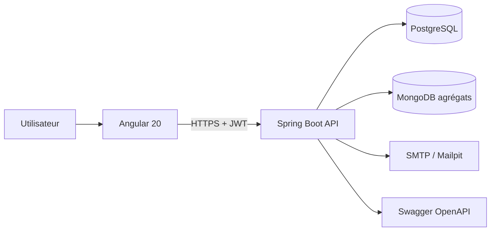

# Architecture

```mermaid
flowchart LR
  U[Utilisateur] --> A[Angular 20]
  A -->|HTTPS + JWT| S[Spring Boot API]
  S --> P[(PostgreSQL)]
  S --> M[(MongoDB agrégats)]
  S --> E[SMTP / Mailpit]
  S --> O[Swagger OpenAPI]
```
