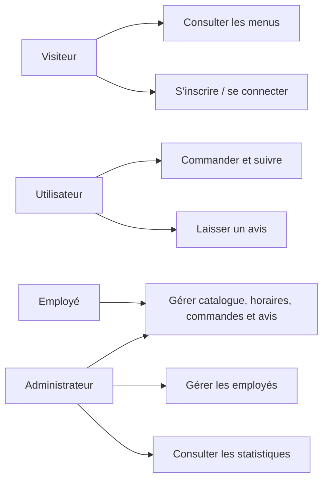

# Cas d’utilisation

```mermaid
flowchart LR
  V[Visiteur] --> C[Consulter les menus]
  V --> R[S’inscrire / se connecter]
  U[Utilisateur] --> O[Commander et suivre]
  U --> A[Laisser un avis]
  E[Employé] --> G[Gérer catalogue, horaires, commandes et avis]
  AD[Administrateur] --> G
  AD --> GE[Gérer les employés]
  AD --> S[Consulter les statistiques]
```
