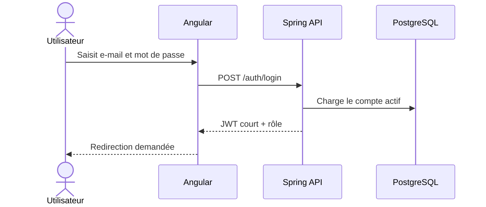
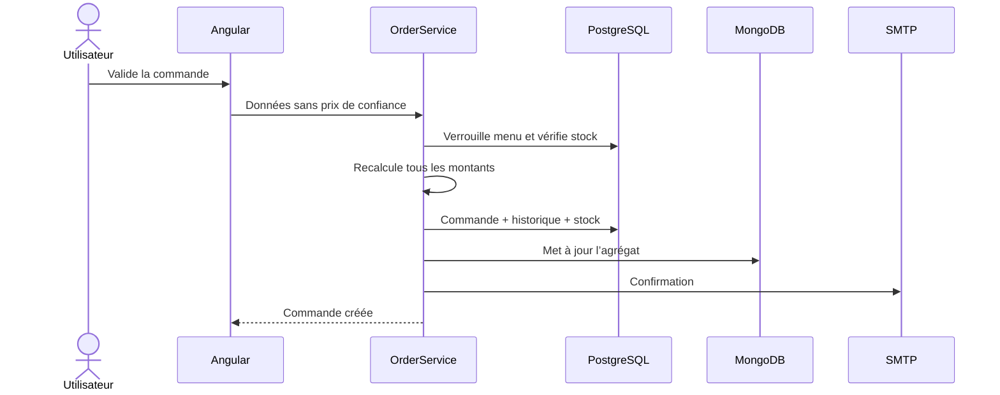

# Séquences

```mermaid
sequenceDiagram
  actor U as Utilisateur
  participant A as Angular
  participant API as Spring API
  participant DB as PostgreSQL
  U->>A: Saisit e-mail et mot de passe
  A->>API: POST /auth/login
  API->>DB: Charge le compte actif
  API-->>A: JWT court + rôle
  A-->>U: Redirection demandée
```

```mermaid
sequenceDiagram
  actor U as Utilisateur
  participant A as Angular
  participant API as OrderService
  participant DB as PostgreSQL
  participant M as MongoDB
  participant Mail as SMTP
  U->>A: Valide la commande
  A->>API: Données sans prix de confiance
  API->>DB: Verrouille menu et vérifie stock
  API->>API: Recalcule tous les montants
  API->>DB: Commande + historique + stock
  API->>M: Met à jour l’agrégat
  API->>Mail: Confirmation
  API-->>A: Commande créée
```
