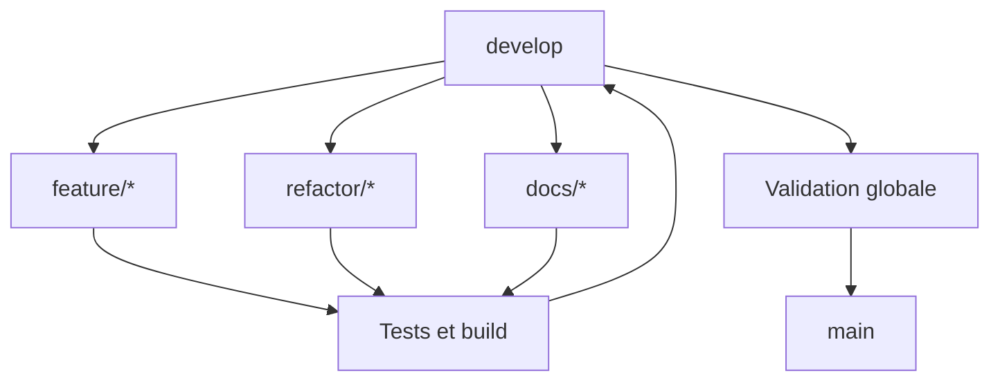

# Vite & Gourmand - Documentation de gestion de projet

**Projet ECF - TP Développeur Web et Web Mobile**  
**Candidate : Kelly FURNARI**  
**Date : juillet 2026**

## 1. Synthèse

Le projet Vite & Gourmand a été conduit de manière itérative, avec un suivi léger adapté à un développement individuel. GitHub constitue le centre de traçabilité : dépôt public, Issues, branches, commits et fusions.

- Dépôt public : https://github.com/Scodyx/Vite-et-gourmand
- Gestion de projet : https://github.com/Scodyx/Vite-et-gourmand/issues
- Front-end : https://vite-gourmand-ztdw.onrender.com
- API : https://vite-gourmand-api-5a1o.onrender.com

## 2. Méthode retenue

La méthode est proche d’un Kanban léger : les besoins sont découpés en tâches courtes, priorisées selon les dépendances techniques et la valeur métier. Chaque tâche produit un résultat vérifiable avant le passage à la suivante.

Phases principales :

1. Analyse des besoins et règles métier.
2. Conception de l’architecture, des données et des maquettes.
3. Mise en place du socle Spring Boot, sécurité et PostgreSQL.
4. Réalisation de l’interface Angular.
5. Développement des parcours métier.
6. Tests, corrections et sécurité.
7. Déploiement Render, Neon, Atlas et Brevo.
8. Finalisation de l’interface, refactorisation et documentation.

## 3. Découpage fonctionnel

| Lot | Contenu | Critère de fin |
|---|---|---|
| Socle technique | Structure, bases, configuration locale | Applications démarrables |
| Authentification | Inscription, connexion, JWT, reset | Accès sécurisé par rôle |
| Catalogue | Menus, plats, allergènes, horaires | Consultation et gestion |
| Commandes | Création, prix, livraison, suivi | Parcours client complet |
| Employé | Filtres et statuts | Traitement des commandes |
| Administration | Employés, catalogue, avis, statistiques | Pilotage complet |
| E-mails | Bienvenue, reset, commande, contact | Réception vérifiée |
| Déploiement | Docker et services managés | Application publique |
| Qualité et livrables | Tests, UI, README et PDF | Version livrable sur main |

## 4. Stratégie Git

- `main` : version stable et livrable.
- `develop` : branche d’intégration.
- `feature/*` : fonctionnalités métier.
- `refactor/*` : lisibilité et organisation du code.
- `docs/*` : documentation et livrables.

Flux :

Conventions de commits : `feat`, `fix`, `refactor`, `docs`, `merge`, `release`.

## 5. Cycle d’une tâche

1. Analyser le besoin.
2. Définir les critères d’acceptation.
3. Créer une branche depuis `develop`.
4. Réaliser des modifications limitées au périmètre.
5. Exécuter tests, build et recette ciblée.
6. Fusionner dans `develop` avec `--no-ff`.
7. Vérifier l’intégration et le déploiement.
8. Fusionner `develop` dans `main` pour la livraison.

### Définition de terminé

Une tâche est terminée lorsque le comportement attendu fonctionne, les tests passent, le build est valide, aucun secret n’est exposé, la branche est fusionnée et la documentation est mise à jour.

## 6. Qualité

- 64 tests back-end réussis.
- 55 tests Angular réussis.
- Build Spring Boot et build Angular réussis.
- Contrôle `git diff --check`.
- Tests du endpoint de santé et de l’application déployée.
- Vérification réelle des e-mails Brevo.
- Recette manuelle des rôles client, employé et administrateur.

## 7. Difficultés et solutions

| Difficulté | Solution |
|---|---|
| Secrets et variables de production | Variables d’environnement, valeurs factices, rotation d’un secret exposé |
| Différences local/production | Profil `prod`, Docker, configuration runtime Angular et endpoint de santé |
| CORS et URLs | Centralisation de `FRONTEND_URL` et `API_URL` |
| Création administrateur | Initialiseur conditionnel désactivé après création |
| E-mails | Tests réels via Brevo |
| Code compact | Externalisation Angular et formatage Java sans changement fonctionnel |
| Branche distante vide | Vérification de `git status` et ajout explicite avant commit |
| PDF absent du projet | Copie dans `documentation/` avant `git add` |

## 8. Bilan et améliorations

Points forts : découpage progressif, traçabilité Git, validation avant publication, déploiement public et livrables intégrés au dépôt.

Axes d’amélioration :

- créer le backlog complet dès le démarrage ;
- utiliser systématiquement labels, priorités et jalons ;
- mettre en place GitHub Actions ;
- utiliser les pull requests pour toutes les fusions ;
- renforcer les tests E2E et le suivi RGAA.

## 9. Checklist de livraison

- [ ] Dépôt public et `main` à jour
- [ ] Front-end et API accessibles
- [ ] Comptes de démonstration testés
- [ ] Aucun secret dans le dépôt
- [ ] README vérifié
- [ ] Fichiers SQL présents
- [ ] Manuel utilisateur PDF présent
- [ ] Charte graphique PDF et six maquettes présentes
- [ ] Documentation de gestion de projet présente
- [ ] Documentation technique et diagrammes présents
- [ ] Copie ECF complétée
