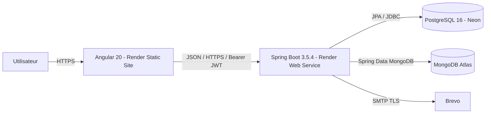
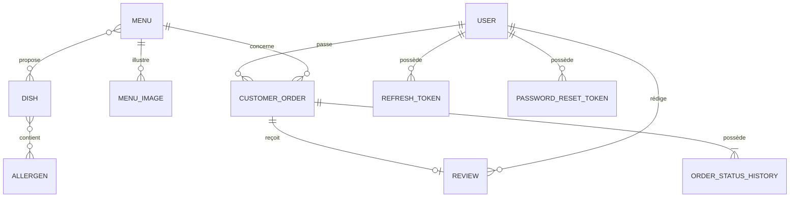
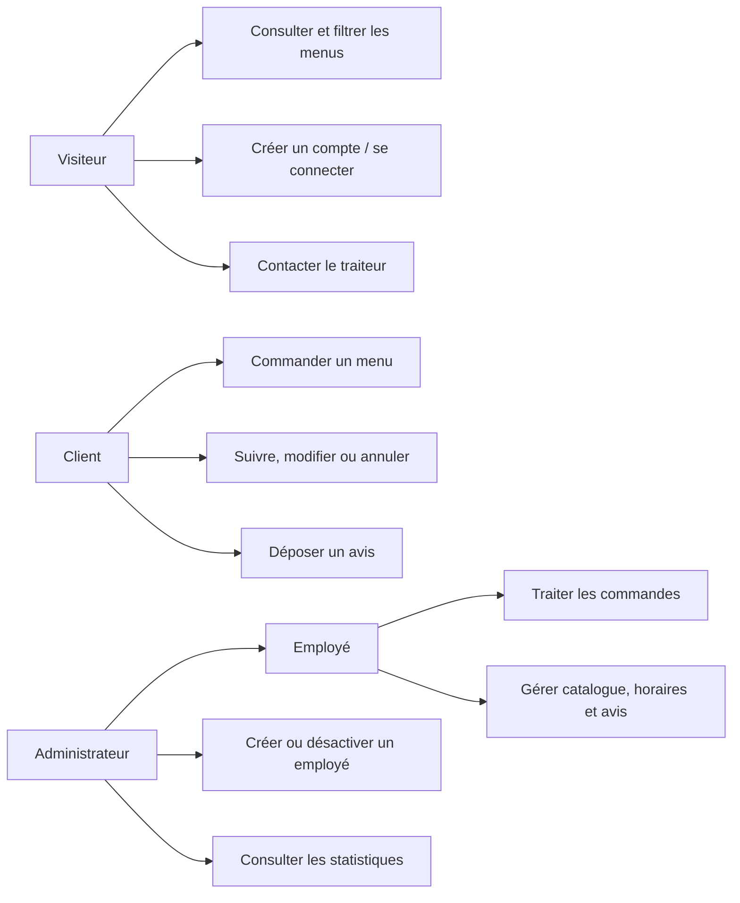
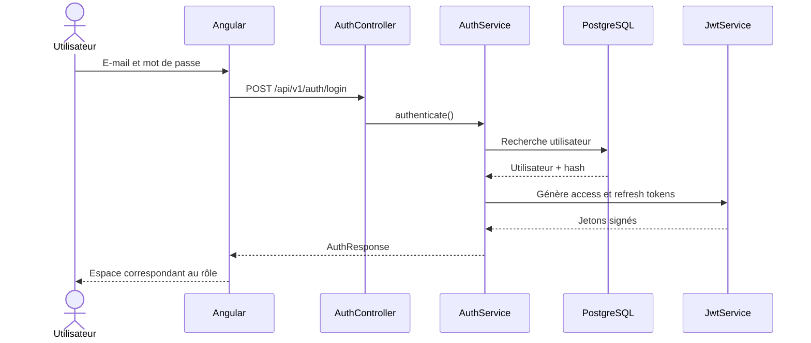
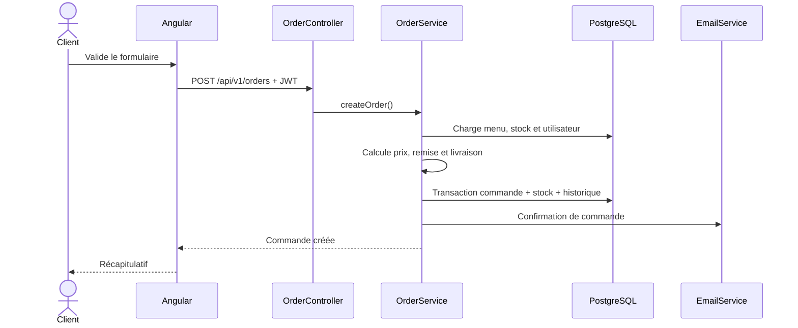

# Vite & Gourmand - Documentation technique

**Projet ECF - TP Développeur Web et Web Mobile**  
**Candidate : Kelly FURNARI**  
**Version : juillet 2026**

## 1. Objet et périmètre

Cette documentation décrit les choix technologiques, l'architecture, l'environnement local, les modèles de données, les parcours techniques, la sécurité, les tests et le déploiement de l'application Vite & Gourmand.

- Dépôt public : https://github.com/Scodyx/Vite-et-gourmand
- Front-end : https://vite-gourmand-ztdw.onrender.com
- API : https://vite-gourmand-api-5a1o.onrender.com

## 2. Stack technique

| Couche | Technologie | Rôle |
|---|---|---|
| Front-end | Angular 20 standalone, TypeScript, HTML5, SCSS | SPA responsive, formulaires, navigation, guards et appels API |
| Back-end | Java 21 LTS, Spring Boot 3.5.4 | API REST, règles métier, sécurité et transactions |
| Sécurité | Spring Security, JWT, refresh tokens, BCrypt | Authentification stateless et autorisation par rôle |
| SQL | PostgreSQL 16, JPA/Hibernate, Flyway | Données transactionnelles et migrations V1 à V3 |
| NoSQL | MongoDB 7 | Statistiques agrégées par menu |
| Local | Docker Compose, Mailpit | Services reproductibles et test des e-mails |
| Production | Render, Neon, MongoDB Atlas, Brevo | Hébergement public et services managés |
| Qualité | JUnit, Mockito, Jasmine/Karma, Playwright | Tests unitaires, composants et parcours ciblés |

## 3. Architecture



## 4. Environnement local

Prérequis : Git, Docker Desktop, JDK 21, Node.js/npm et un éditeur tel que Visual Studio Code.

```powershell
docker compose up -d
docker compose ps

cd backend
$env:SPRING_PROFILES_ACTIVE = "dev"
.\mvnw.cmd spring-boot:run

cd ..\frontend
npm install
npm start
```

Services locaux : Angular `4200`, API `8080`, PostgreSQL `5432`, MongoDB `27017`, Mailpit SMTP `1025` et interface `8025`.

## 5. Organisation du code

- `frontend/` : application Angular, services, guards, interceptor, composants et tests.
- `backend/` : API Spring Boot organisée par domaines fonctionnels.
- `database/` : fichiers SQL de création et d'insertion.
- `documentation/` : livrables et diagrammes.
- `scripts/` : tests smoke et nettoyage des données de validation.

Le back-end sépare contrôleurs, DTO, services, entités/documents et repositories. Le front-end sépare modèles, services d'accès API, sécurité et écrans fonctionnels.

## 6. Modèle relationnel principal



Les données transactionnelles restent dans PostgreSQL. Les statistiques agrégées sont reconstruites depuis les commandes et stockées dans MongoDB.

## 7. Cas d'utilisation



## 8. Séquences principales

### Authentification



### Création d'une commande



## 9. Règles métier majeures

- nombre de personnes au moins égal au minimum du menu ;
- remise de 10 % à partir de cinq personnes au-dessus du minimum ;
- frais hors Bordeaux : base de 5 euros plus 0,59 euro par kilomètre ;
- stock contrôlé et décrémenté dans une transaction ;
- modification et annulation limitées selon le statut ;
- transitions de statut validées côté serveur ;
- historique horodaté de chaque changement ;
- avis unique lié à une commande terminée et soumis à modération.

## 10. Sécurité

- formulaires Angular et DTO Spring validés ;
- mot de passe d'au moins 10 caractères avec majuscule, minuscule, chiffre et caractère spécial ;
- mots de passe hachés avec BCrypt ;
- API stateless avec access token et refresh token ;
- refresh tokens révocables et jetons de réinitialisation expirables ;
- rôles `USER`, `EMPLOYEE` et `ADMIN` contrôlés côté serveur ;
- guards et interceptor Angular pour l'expérience utilisateur, sans remplacer les contrôles back-end ;
- CORS limité à l'origine front-end configurée ;
- requêtes paramétrées par JPA/Hibernate et contraintes SQL ;
- erreurs centralisées sans fuite de stack trace ;
- secrets exclusivement dans les variables d'environnement ;
- compte administrateur initialisé de façon conditionnelle, puis initialiseur désactivé.

## 11. API et documentation

L'API est préfixée par `/api/v1`. Les principales familles sont :

- `/public/*` : menus, horaires, avis, contact et healthcheck ;
- `/auth/*` : inscription, connexion, refresh, logout et mot de passe oublié ;
- `/users/*` : profil ;
- `/orders/*` : commandes et suivi ;
- routes employé et administrateur pour la gestion métier ;
- statistiques administrateur.

En local : Swagger UI `http://localhost:8080/swagger-ui/index.html` et document OpenAPI `http://localhost:8080/v3/api-docs`.

## 12. Tests et validation

- 64 tests back-end réussis ;
- 55 tests Angular réussis ;
- builds Spring Boot et Angular réussis ;
- scénarios Playwright ciblés ;
- `git diff --check` et contrôle du périmètre ;
- tests 401/403, CORS, Swagger, Flyway, Docker et e-mails ;
- recette manuelle des rôles visiteur, client, employé et administrateur ;
- endpoint public de santé validé en production.

## 13. Déploiement

1. Fusionner la version validée dans `main`.
2. Render construit le front-end Angular et le back-end à partir du Dockerfile.
3. Configurer les variables d'environnement sans publier les valeurs réelles.
4. Connecter PostgreSQL Neon, MongoDB Atlas et Brevo SMTP.
5. Flyway applique les migrations au démarrage du back-end.
6. Vérifier le healthcheck, le chargement du front, l'authentification, les rôles et les e-mails.
7. Désactiver l'initialiseur administrateur après la création du compte de démonstration.

## 14. Exploitation et maintenance

- consulter les journaux Render en cas d'erreur ;
- contrôler les statuts Neon, Atlas et Brevo ;
- ne jamais modifier une migration Flyway déjà appliquée ;
- créer une nouvelle migration numérotée ;
- changer ou désactiver les comptes de démonstration après l'évaluation ;
- effectuer une rotation immédiate de tout secret exposé ;
- exécuter tests et builds avant toute publication.

## 15. Limites et améliorations

- automatiser les tests et builds avec GitHub Actions ;
- renforcer les tests E2E de tous les parcours ;
- ajouter des contrôles RGAA automatisés ;
- formaliser les sauvegardes et la restauration des bases ;
- ajouter des métriques et alertes de production ;
- compléter les contrôles de distance par un service géographique fiable.
